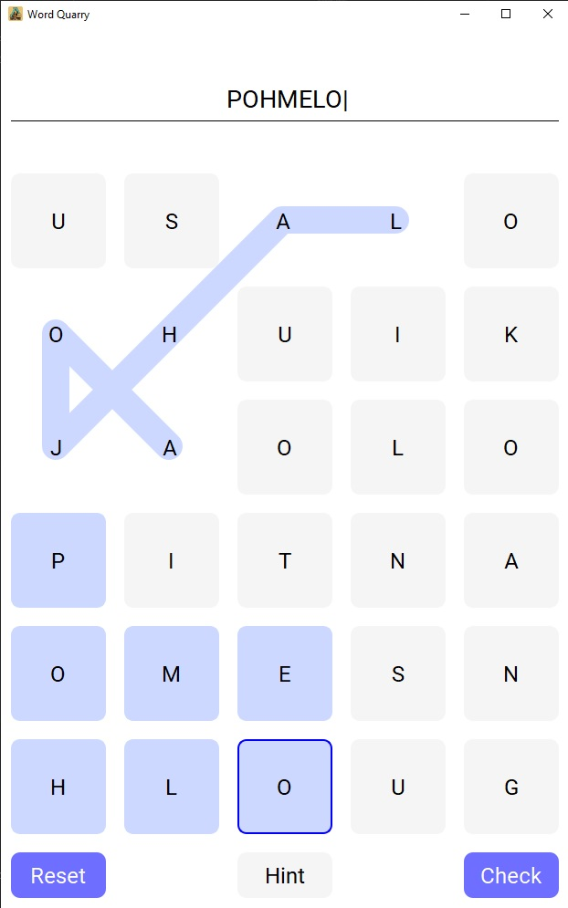

# Word Quarry

A game where you have to find all the scrambled words in a grid. Each letter in the grid belongs to a word, so make sure to use each and every one of them.

The current list of words are extracted from the [list provided by the Institude for the Languages of Finland.](https://www.kotus.fi/aineistot/sana-aineistot/nykysuomen_sanalista)

Inspired by the ["Sanalouhos" game by Helsingin Sanomat (Mikko Kivistö, Katariina Rahkola, Juhani Saarinen and Anni Mutikainen).](https://www.hs.fi/pelit/art-2000010229611.html)

## Current state

The repository has a script for extracting the usable words from the KOTUS list (`csv_to_wordlist.py`).

The game is able to create the grid of letters via a brute-force algorithm and the UI allows the user to select letters and reset the board. The actual game functionality is still under development.

Screenshot of the UI:

## Usage

1. Install the latest Pandas and Numpy libraries with  
    `pip install pandas`  
    `pip install numpy`  
2. Run the game from Powershell / terminal / command line with `python wordquarry.py`